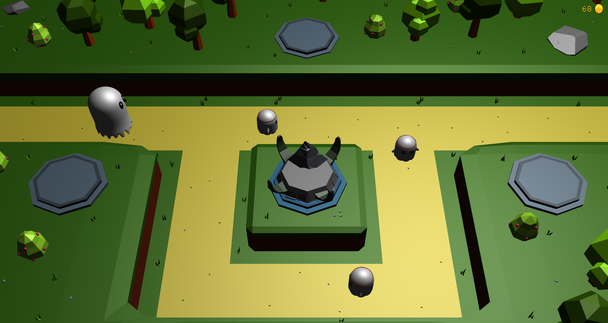
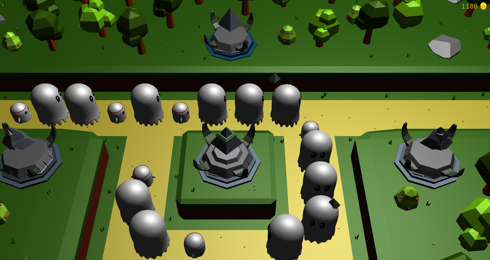
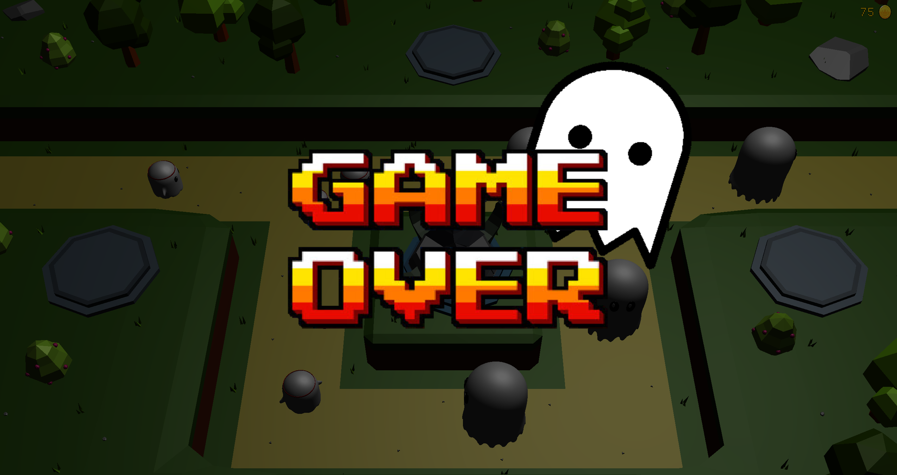

# 👻 Phantom Defenders

This is a university project by [@LouisOwie](https://github.com/LouisOwie/) and [@JawdatAlqawi](https://github.com/JawdatAlqawi) for the Computer Graphics Lab at the University of Siegen.
It is a 3D tower defense game demonstrating real-time rendering and basic game mechanics.

## 🚀 Getting Started

### Prerequisites
Make sure the following software is installed on your system:

- Operating System: Windows (macOS / Linux is not tested)
- Programming language / runtime: C++23
- CMake version: 3.10 or higher
- Graphics framework / API: OpenGL


All required libraries are included directly in the repository. No additional dependencies need to be installed.

### Installation

Clone the repository:

```bash
git clone --recursive https://github.com/LouisOwie/phantom-defenders
```
CMake Configuration:

```bash
cd phantom-defenders
mkdir build
cd build
cmake ..
```

Build the project:

```bash
cmake --build .
```

Run the game:

```bash
cd Debug
./phantom-defenders.exe
```

## 🎮 Controls
- **W/A/S/D**: Move the camera
- **Q/E**: Yaw the camera
- **up/down/left/right**: Select platforms
- **Space**: Deselect platform
- **Enter**: Place / Upgrade tower

## 💰 Tower Costs

| Tower Level | Cost | Damage | AttackSpeed |
|-------------|------|--------|-------------|
| 1           | 50   | 8      | 1.0         |
| 2           | 100  | 12     | 1.5         |
| 3           | 300  | 15     | 2.5         |
| 4           | 700   | 25     | 3.0         |

## 📸 Screenshots
Here are some screenshots from Phantom Defenders:





## 📄 License
This project is intended for educational and non-commercial use.
